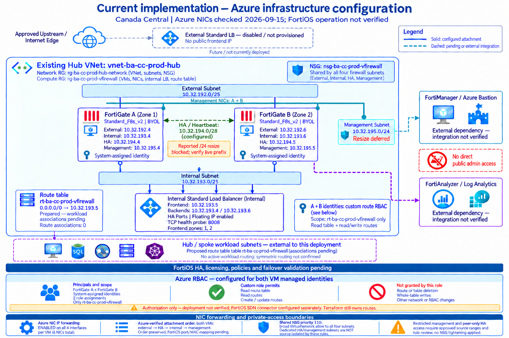

# FortiGate Virtual Firewall

This repository deploys a switchable FortiGate virtual firewall architecture
into an existing Azure hub VNet. It supports a minimal single-node POC and a
two-node active-passive HA foundation.

## Start here

| Document | Purpose |
|---|---|
| [Architecture](architecture.md) | Simple and HA topology, subnets, NICs, load balancers, identities, and route behavior. |
| [Deployment runbook](runbooks/deployment.md) | Terraform initialization, GitHub Actions, Azure DevOps, prerequisites, and apply sequence. |
| [Operations reference](reference/operations.md) | Port mapping, RBAC, network controls, troubleshooting, validation, and production-readiness checks. |

## Current dev mode

The checked-in dev environment uses the `single` architecture switch:

```hcl
fortigate_deployment_mode = "single" # change to "ha" for the HA profile
```

Single mode provisions one BYOL FortiGate VM with two NICs:

- External subnet: `10.32.192.0/25`
- Internal subnet: `10.32.193.0/25`
- VM size: `Standard_F4s_v2`
- No HA NIC, management NIC, load balancer, or public IP
- Azure IP forwarding enabled on both interfaces
- Shared NSG and route-table integration retained for the POC

The smallest supported candidate is `Standard_F2s_v2`; changing the existing
VM to that SKU is a separate resize/replacement decision.

## Architecture images




## Important boundaries

- The hub VNet and dedicated firewall subnets are existing platform resources.
- Azure infrastructure does not configure FortiOS licensing, policies, or HA
  clustering.
- No public administration path is created.
- Workload route-table associations remain pending until approved subnet IDs are
  supplied.
- Existing Azure resources and role assignments must be imported into state or
  removed before Terraform apply.

## Useful commands

```powershell
terraform init -reconfigure -input=false `
  -backend-config="environments/dev/backend.hcl"

terraform plan -input=false `
  -var-file="environments/dev/terraform.tfvars"
```

Use the deployment runbook for backend configuration, credentials, imports,
and the automated pipeline behavior.

## Repository layout

```text
architecture.md                         Architecture and mode design
runbooks/deployment.md                   Deployment and pipeline runbook
reference/operations.md                 Operations and troubleshooting reference
docs/images/                             Simple and full architecture diagrams
environments/dev/                        Dev Terraform variables and backend
.github/workflows/terraform.yml         Validate, plan, and configured dev apply
.github/workflows/pages.yml             Publish the public documentation portal
```
