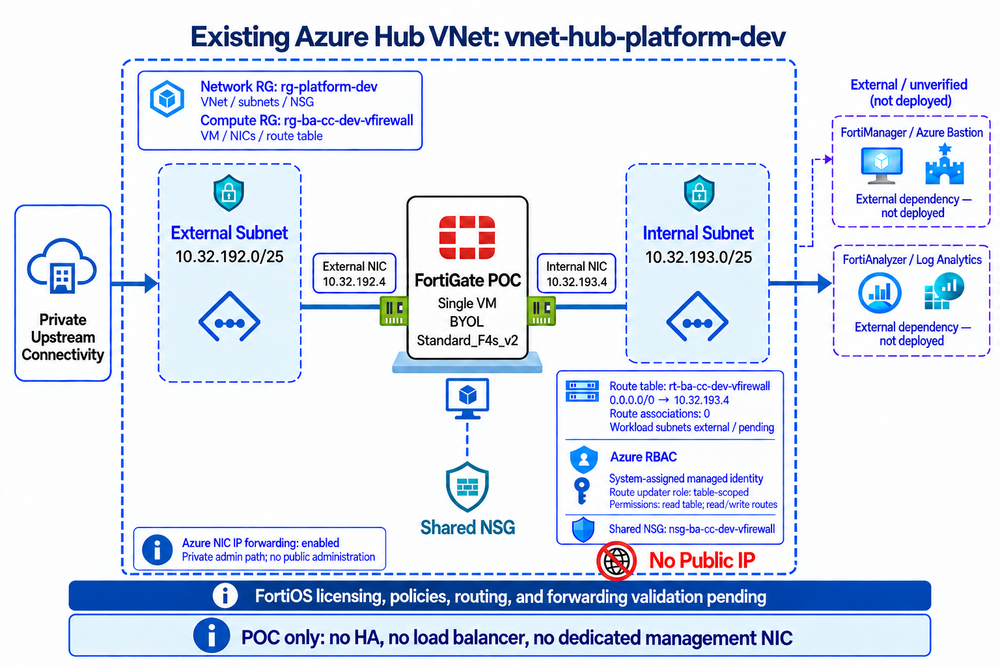

# FortiGate Architecture

Configuration paths in this document are relative to the Azure Terraform root:
`platforms/azure/`.

## Design summary

The deployment has one architecture switch:

```hcl
fortigate_deployment_mode = "single" # or "ha"
```

`single` is the current minimal POC profile. `ha` preserves the full
active-passive design for a later production-oriented deployment.

## Simple mode



Single mode creates one FortiGate BYOL VM with two interfaces:

| Interface | Subnet | Current example |
|---|---|---|
| External | `snet-ba-cc-dev-vfirewall-external` (`10.32.192.0/25`) | `10.32.192.4` |
| Internal | `snet-ba-cc-dev-vfirewall-internal` (`10.32.193.0/25`) | `10.32.193.4` |

It does not create or enable a heartbeat NIC, management NIC, external load
balancer, internal load balancer, or public management IP. Administration stays
on the approved private path.

## HA mode


Changing the switch to `ha` enables the preserved HA profile:

- Two FortiGate BYOL VMs distributed across availability zones.
- External, internal, HA/heartbeat, and management interfaces on each VM.
- Internal and external load-balancer inputs with HA ports and health probes.
- Dedicated HA and management subnets.
- One system-assigned identity and route-table-scoped assignment per VM.

Terraform prepares the Azure foundation only. FortiOS licensing, cluster
formation, policies, failover testing, and production validation remain
separate operational steps.

## Mode sizing

| Mode | VMs | Interfaces per VM | Load balancers | Default size |
|---|---:|---|---|---|
| `single` | 1 | External, internal | None | `Standard_F4s_v2` |
| `ha` | 2 | External, internal, HA, management | Configured HA profile | `Standard_F8s_v2` |

`fortigate_vm_size` overrides the mode default when non-empty. `Standard_F2s_v2`
is the smallest two-NIC candidate for the POC, but capacity and marketplace
licensing compatibility must be confirmed before resizing.

## Shared Azure controls

Both modes use the existing hub VNet, Azure IP forwarding, standard tags,
Premium SSD OS disks, private administration, and the shared network security
model. A route table can point the default route to the single internal IP or
the HA internal load-balancer frontend.

The current route behavior is:

| Mode | Virtual-appliance next hop |
|---|---|
| `single` | Single FortiGate internal IP, normally `10.32.193.4` |
| `ha` | Internal load-balancer frontend, normally `10.32.193.5` |

Workload subnet associations are intentionally empty until approved workload
subnet resource IDs are supplied.

## Identity and RBAC

The FortiGate VM identity receives only the route-table permissions required by
the deployment pattern. It is not a whole-subscription network administrator
grant.

Application groups can receive Contributor or Reader access to the FortiGate
resource group through the shared resource-group module. Pre-existing role
assignments must be imported or removed before apply.

## Resource ownership

The hub VNet and platform resource group are looked up as existing resources.
The FortiGate resource group, VM, NICs, route table, and selected subnet/NSG
objects are managed according to the enabled features in
`environments/dev/terraform.tfvars`. Review ownership before changing a shared
subnet or NSG.
